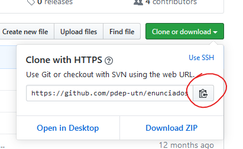

# Mini TPs - Paradigma Funcional 2020

Nombre y Apellido: ***Nahuel Farias***

**[](https://travis-ci.com/pdep-mit/mini-tps-funcional-2020-NahuelFarias)**

## Consignas

En la carpeta `consignas` estarán disponibles los ejercicios a realizar para cada mini TP, en formato Markdown (.md). Estos archivos pueden leerse mejor desde GitHub o usando la vista previa de VSCode, el editor recomendado para trabajar.

La resolución correspondiente debe realizarse en el archivo .hs que corresponda de los que ya se incluyen en este repositorio, dentro de la carpeta `src`.

**Pro-Tip:** En el VSCode podés abrir la vista previa en un panel separado del archivo que estás editando. Eso te va a facilitar trabajar sobre cada TP, teniendo la consigna al lado.

> A lo largo de la cursada estaremos agregando nuevo contenido a este repositorio, tanto de consignas como código de base, que será el punto de partida para los siguientes mini TPs.

## Preparación de entorno de trabajo

1. Si todavía no lo hiciste, asegurate de instalar tu entorno de Haskell para trabajar siguiendo [esta guía](https://github.com/pdep-utn/enunciados-miercoles-noche/blob/master/pages/haskell/entorno.md), para que tengas todas las herramientas que necesitás y un editor de texto que te ayude a identificar errores en tiempo de compilación.

   Las herramientas a instalar son:
    - Git: para trabajar con versionado de código, hoy en día considerado el estándar de la industria para ese fin.
    - Stack: además de proveerte una instalación de Haskell, permite correr pruebas automáticas (o tests) muy fácil.
    - Visual Studio Code: editor de texto gratuito con herramientas integradas que te permiten desarrollar con mayor comodidad.

    **Aclaración:** los plugins de Markdown y GitLens para el VSCode que se recomiendan en esa guía son opcionales para nuestro curso. Se pueden seguir los pasos del TP0 sin instalarlos. Si ya instalaste GitLens pero preferís no usarlo (puede resultar un poco invasivo), es posible desactivar la extensión directamente.

    > **IMPORTANTE:** si estás recursando la materia y ya tenías Haskell instalado, tené en cuenta que *stack* es una herramienta separada. Si no la usaste hasta ahora, no te saltees su instalación. Y si sí la usaste asegurate de que esté actualizada usando:
    >
    > ```
    > stack upgrade
    > stack update
    > ```

2. Abrí una consola (puede ser una nativa de tu sistema operativo o Git Bash) y cloná este repositorio con el comando: `git clone urlParaClonarEsteRepo`. La URL la podés sacar de GitHub como se muestra acá:

   

3. Navegá al directorio nuevo con el comando `cd nombreDelRepo` y luego ejecutá `code .` para abrir el VSCode en ese lugar, o abrí el editor y elegí manualmente la carpeta que se te creó al clonar el repo.

    Ahí vas a poder ver y editar los archivos que están en este repositorio, así como ejecutar el código Haskell desde una terminal dentro del mismo editor.

4. Luego de abrir una terminal desde el menú Terminal del VSCode (o con `ctrl-shift-ñ`) ejecutá el comando `stack test`.

   **Nota:** la primera vez que ejecutes este comando va a tardar un poco, porque tiene que descargar varias cosas para configurar el entorno de cero antes de poder correr las pruebas. Cada vez que quieras correr las pruebas automáticas, volvé a ejecutar `stack test`.

   Si todo anduvo bien y todavía no hiciste los cambios del TP0 vas a ver algo como esto en la terminal:

    ```
    TP0
      La respuesta
        ... a la vida, el universo y todo lo demas ... FAILED [1]

    ... detalles del test fallido ...

    1 example, 1 failures
    ```

    Es importante que te asegures de que **todo el código del proyecto compila**, de lo contrario no se van a poder ejecutar las pruebas.

5. Además de correr las pruebas automáticas, podés usar `stack ghci` para ejecutar el intérprete de Haskell con todo el código que se encuentra en la carpeta `src` ya cargado.

    Si sólo querés cargar uno de esos archivos .hs podés indicarlo con el comando: `stack ghci .\src\NombreDelArchivo.hs`.

    > **Nota:** si luego de ejecutar el comando para correr ghci hiciste cambios en el código, podés escribir `:reload` o `:r` para que vuelva a cargar los archivos .hs sin tener que volver a levantar el intérprete de Haskell. Para salir del intérprete ghci y volver a la terminal del sistema operativo podés usar `:quit`.
