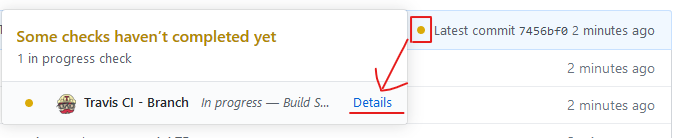
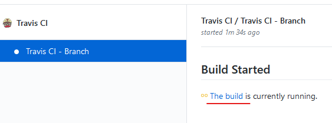
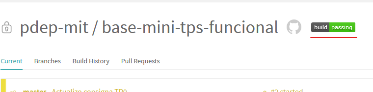

# Consigna TP0

## Objetivos

- Que empieces a conocer algunas de las herramientas que vamos a estar usando durante la cursada, asegurando que te funcionen antes de que que sigamos avanzando con la práctica del paradigma funcional.
- Empezar a incorporar la ejecución de pruebas automáticas al flujo de trabajo, para asegurar que la solución propuesta cumpla con la funcionalidad esperada.
- Usar un entorno de desarrollo que te ayude a detectar y resolver problemas de forma temprana.
- Usar un repositorio de código donde puedas subir tus cambios todas las veces que quieras, para que tus tutores puedan verlos y dejarte comentarios, así como también mantener un historial de lo que fuiste haciendo, sin miedo a perder tu trabajo.

> Tené en cuenta que las pruebas automáticas no se van a correr solamente en tu máquina, también se van a correr en un servidor luego de que subas tus cambios al repositorio. La herramienta que se encarga de correr las pruebas, dejando los resultados disponibles para que tus tutores puedan verlos, se llama Travis.
>
> Ocasionalmente vas a recibir mails de esta herramienta, no hace falta que te preocupes mucho por eso. Para esta materia alcanza con que sepas que existe y que la vamos a estar usando para simplificar el trabajo de revisión de trabajos prácticos.

## Parte 1: Probar tu entorno

1. Seguí los pasos explicados en la sección **Preparación de entorno de trabajo** del archivo `README.md` y asegurate de que el test del TP0 **falle** con un error al ejecutar el comando `stack test`, ya que todavía no se implementó lo necesario en el archivo `src/TP0.hs` para que el test funcione.

   A pesar de ese **error durante la ejecución**, de todos modos debería mostrarse el resumen de haber corrido de las pruebas: `1 example, 1 failure`. Esto indica que se corrió un solo caso de prueba, y hubo un resultado fallido.

   > En Haskell se puede usar la expresión `undefined` para postergar la implementación de algunas funciones que nos interesa que existan, permitiendo que el programa compile de todos modos. Pero bueno, si al ejecutar tu programa se evalúa esa expresión nos va a tirar error, como en este ejemplo :boom:
   >
   > Si abrís el archivo `src/TP0.hs` vas a ver que eso es lo que se está usando inicialmente en la solución que te damos.

2. En el archivo `src/TP0.hs` cambiá el valor de `laRespuesta` a `7`, guardá los cambios y volvé a correr los tests con `stack test`.

   Deberías ver que el resultado del test todavía no es exitoso, indicando que se esperaba que fuera `42` pero se obtuvo `7`.

   > Con esta implementación ya no hay errores al tratar de conocer el valor para `laRespuesta`. Lo que falla en este caso es la prueba automática, que cuenta con una validación que no se cumplió.

3. Volvé a cambiar ese valor, ahora por el booleano `True` y guardá los cambios.

   Dado que hay un error **en tiempo de compilación**, porque el valor `True` no es del tipo esperado, correr los tests nuevamente con `stack test` **no debería ser posible**. Al ejecutar ese comando deberías ver detalles sobre el error de tipos en vez del resumen de ejecución de tests.

   Lo mismo debería suceder si intentás correr el programa en el intérprete interactivo de Haskell con el comando `stack ghci`.

   > Si tu entorno con VSCode + el plugin **Simple GHC (Haskell) integration** está correctamente instalado, también debería marcarte el error de tipos **antes** de intentar correr el programa dentro del mismo editor, subrayando el error y listándolo en la vista de problemas (si no la encontrás, usá `View -> Problems`). Esa es una gran ventaja de tener un buen entorno de desarrollo, nos ayuda a detectar problemas de forma temprana!

4. Volvé a cambiar el valor para `laRespuesta`, esta vez usando el número `42`, y ejecutá el comando `stack test` nuevamente, para confirmar que el test del TP0 ahora sí funciona. El mismo debería mostrarse en verde, para indicar que funcionó como se esperaba, y el resumen final de ejecución debería decir: `1 example, 0 failures` ya que se ejecutó un solo caso de prueba y no hubieron fallos.

## Parte 2: Actualizar el README

El **README** de un proyecto es básicamente una carta de presentación. Es común que incluya información útil para otras personas, y también un indicador de si las pruebas existentes funcionan al contar con herramientas como Travis. Ese indicador es comúnmente conocido como Badge.

1. En el archivo `README.md` que está en la raíz del proyecto completá con tu nombre y apellido donde se indica.

2. Agregá el Badge de Travis en el lugar indicado, en formato **Markdown**. Una vez que termines el TP0 tu repo GitHub va a mostrar el Badge que da información respecto a si todas las pruebas que se encuentran en este proyecto pudieron correrse sin problemas luego de cada cambio que subas al repositorio GitHub de ahora en más.

   Para conseguir el texto a copiar en el `README.md` de modo que aparezca el Badge de Travis correctamente:

   1. En tu repo GitHub, donde se muestra el último commit, debería aparecer un ícono que puede ser distinto al que se muestra en esta imagen, dependiendo de si ya se corrieron los tests en el servidor y cuál fue el resultado. Si clickeás ahí vas a encontrar este link:

   

   2. Luego de clickear en details tenés que seguir este link para que te lleve a la página de Travis, donde vas a poder generar el texto para mostrar el Badge:

   

   3. Finalmente, en la página de Travis, vas a poder conseguir el texto a copiar en el `README.md` para que luego aparezca el Badge al entrar a tu repo GitHub siguiendo estos pasos:

      1. Clickeás en el Badge de Travis
      
      1. Seleccionás el formato **Markdown** y copiás el texto que aparece abajo:
      
      1. Ese texto que copiaste lo pegás directamente en el `README.md` de este repo, y listo!

   El objetivo de esto es que sea fácil de ver el estado actual de tu proyecto. Además clickeando en el Badge se puede navegar fácilmente a la página de Travis, donde se puede ver el detalle de la ejecución de los tests automáticos en el server, no sólo si pasan o no. Una belleza :heart_eyes:

## Parte 3: Subir tus cambios a GitHub

En la terminal corré los siguientes comandos para:

1. Agregar todos tus cambios a lo que será tu siguiente commit (podés verlo como un paquetito con los cambios que querés compartir):
   ```
   git add .
   ```
2. Commitear tus cambios con un mensaje representativo:
   ```
   git commit -m "Terminado el TP0"
   ```
   Tené en cuenta que eso sólo impacta a tu repositorio local (sigue estando sólo en tu máquina). Por eso lo siguiente es...
3. Subir tus cambios al repositorio remoto (GitHub):
   ```
   git push
   ```

> Git tiene muchas más funcionalidades, en esta materia sólo usaremos las más básicas, incorporando un par más cuando amerite. Si en algún momento tenés problemas que no sabés resolver, contactá a tus tutores para que te den una mano.

## Parte 4: Avisar que terminaste el TP

Entrá a tu repo en GitHub y luego de verificar que tu solución se haya subido, incluyendo los cambios al `README.md` de la segunda parte, avisanos creando un issue de esta forma:

1. En la página de issues de tu repo, creás un issue nuevo:
   

2. Clickeás en el botón para crear un issue de tipo **Entrega de TP**:
   

3. Completás el issue con la info correspondiente como se explica en el template (podés borrar el texto que ya viene, pero no te olvides de arrobar a tus tutores):
   

   > Usando la opción Preview esas instrucciones se ven más amigables, por si te sirven.

4. Luego de confirmar que está todo en orden, clickeás en el botón para crear el issue y listo! :tada:

De ahí en más, tus tutores van a darte el seguimiento necesario, creando issues separados para las mejoras que pueden realizarse si las hubiera.