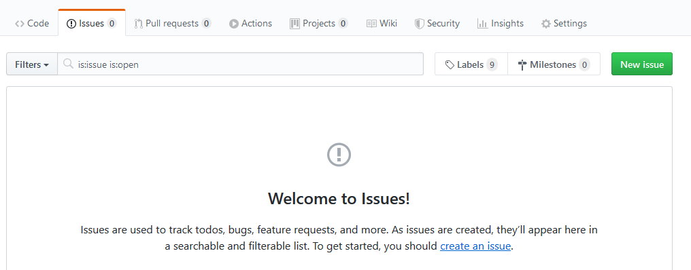

# Consigna TP0

## Objetivos

- Que prepares las herramientas que vamos a estar usando durante la cursada, asegurando que te funcionen antes de que que sigamos avanzando con la práctica del paradigma lógico.
- Seguir usando la ejecución de pruebas automáticas como parte del flujo de trabajo, para asegurar que la solución propuesta cumpla con la funcionalidad esperada.
- Usar un entorno de desarrollo que te ayude a detectar y resolver problemas de forma temprana.
- Usar un repositorio de código donde puedas subir tus cambios todas las veces que quieras, para que tus tutores puedan verlos y dejarte comentarios, así como también mantener un historial de lo que fuiste haciendo, sin miedo a perder tu trabajo.

> Tené en cuenta que las pruebas automáticas no se van a correr solamente en tu máquina, también se van a correr en un servidor luego de que subas tus cambios al repositorio. La herramienta que se encarga de correr las pruebas, dejando los resultados disponibles para que tus tutores puedan verlos, se llama Travis.
>
> Ocasionalmente vas a recibir mails de esta herramienta, no hace falta que te preocupes mucho por eso. Para esta materia alcanza con que sepas que existe y que la vamos a estar usando para simplificar el trabajo de revisión de trabajos prácticos.

Para esta altura de la cursada se asume que ya tenés una noción sobre uso de git, GitHub y Travis, pero te dejamos las instrucciones similares a las del TP0 de funcional. Recordá que si necesitás complementar, está esta playlist donde se explican más en detalle las herramientas que estamos usando: https://www.youtube.com/playlist?list=PL2xYJ49ov_ddydw7wvncxMBzB3wpqPV0u.

## Parte 1: Actualizar el README

El **README** de un proyecto es básicamente una carta de presentación. Es común que incluya información útil para otras personas, y también un indicador de si las pruebas existentes funcionan al contar con herramientas como Travis. Ese indicador es comúnmente conocido como Badge.

Al igual que como hiciste anteriormente para funcional... ni cambiamos los screenshots :stuck_out_tongue_winking_eye:

1. En el archivo `README.md` que está en la raíz del proyecto completá con tu **nombre y apellido** donde se indica.

2. Agregá el Badge de Travis en el lugar indicado, en formato **Markdown**. Una vez que termines el TP0 tu repo GitHub va a mostrar el Badge que da información respecto a si todas las pruebas que se encuentran en este proyecto pudieron correrse sin problemas luego de cada cambio que subas al repositorio GitHub de ahora en más.

   > Tené en cuenta que podrían tardar sólo unos minutos o varias horas en correrse las pruebas en Travis, dependiendo de cuánta gente esté trabajando a la vez. No te preocupes si no se actualiza enseguida.

   Para conseguir el texto a copiar en el `README.md` de modo que aparezca el Badge de Travis correctamente:

   1. En tu repo GitHub, donde se muestra el último commit, debería aparecer un ícono que puede ser distinto al que se muestra en esta imagen, dependiendo de si ya se corrieron los tests en el servidor y cuál fue el resultado. Si clickeás ahí vas a encontrar este link:

   

   1. Luego de clickear en details tenés que seguir este link para que te lleve a la página de Travis, donde vas a poder generar el texto para mostrar el Badge:

   

   1. Finalmente, en la página de Travis, vas a poder conseguir el texto a copiar en el `README.md` para que luego aparezca el Badge al entrar a tu repo GitHub siguiendo estos pasos:

      1. Clickeás en el Badge de Travis
      
      1. Seleccionás el formato **Markdown** y copiás el texto que aparece abajo:
      
      1. Ese texto que copiaste lo pegás directamente en el `README.md` de este repo, y listo!

   El objetivo de esto es que sea fácil de ver el estado actual de tu proyecto. Además clickeando en el Badge se puede navegar fácilmente a la página de Travis, donde se puede ver el detalle de la ejecución de los tests automáticos en el server, no sólo si pasan o no. Una belleza :heart_eyes:

## Parte 2: Preparar y probar tu entorno

1. Como se indica en la sección **Entorno de trabajo** del archivo `README.md` que se encuentra en la raíz del proyecto, vas a necesitar instalar SWI-Prolog y además se puede agregar una extensión al Visual Studio Code para usarlo como editor.
   - Podés instalar SWI-Prolog como se explica en [esta guía](https://github.com/pdep-utn/enunciados-miercoles-noche/blob/master/pages/prolog/entorno.md#ejecutable-prolog) armada por docentes del curso de los miércoles a la noche.
   También incluye recomendaciones para problemas comunes en la instalación sobre Windows.
   - La extensión sugerida para trabajar con Prolog en el VSCode es [VSC-Prolog](https://marketplace.visualstudio.com/items?itemName=arthurwang.vsc-prolog).

   > Si tenés problemas con la extensión de VSCode, tené en cuenta que alternativamente se puede usar el editor que trae integrado SWI-Prolog al ejecutarlo desde la interfaz gráfica (en vez de por consola). Podés abrir ese otro editor (Emacs) con el comando `edit.` dentro de SWI-Prolog.

2. Una vez que tengas tu entorno preparado, corré las pruebas como se indica en la sección **Cómo ejecutar la solución** del `README.md` que se encuentra en la raíz del proyecto (vale correr sólo las del TP0 o las de todo el proyecto, al haber sólo un TP el resultado será el mismo).

   Asegurate de que los tests del TP0 **fallen**, ya que todavía no se implementó lo necesario en el archivo `src/tp0.pl` para que pasen.

   Debería mostrarse el resumen de haber corrido las pruebas, incluyendo algo como esto:
   ```
   % 2 tests failed
   % 0 tests passed
   ```
   y también debería incluir algunos detalles sobre qué fue lo que no funcionó como se esperaba.

   > Vas a ver que vamos a estar usando `???` donde deberían ir los parámetros de los predicados a resolver, para indicar que necesitamos que existan dichos predicados. Esto permite que no se marque como un problema la ausencia de definiciones para los mismos.
   >
   > Si abrís el archivo `src/tp0.pl` encontrarás que eso es lo que se está usando inicialmente en la solución que te damos para el predicado `laRespuesta/1`.

3. En el archivo `src/tp0.pl` cambiá el `???` del predicado `laRespuesta/1` por el átomo `hola`, guardá los cambios y recargá tu programa con el comando `make.`, luego de lo cual volverán a correr los tests.

   Deberías ver que el resultado de las pruebas todavía no es exitoso, indicando que se esperaba que fuera `42` pero se obtuvo `hola`.

4. Volvé a cambiar el valor para `laRespuesta/1`, esta vez usando el número `42`, y recargá tu programa para que se vuelvan a correr los tests. Confirmá que los tests del TP0 ahora sí pasan.

   El resumen final de ejecución debería decir:
   ```
   % PL-Unit: tests_tp0 .. done
   % All 2 tests passed
   ```

## Parte 3: Subir tus cambios a GitHub

Al igual que como estuviste haciendo anteriormente, en la terminal del sistema operativo (o gitbash) corré los siguientes comandos para:

1. Agregar todos tus cambios a lo que será tu siguiente commit:
   ```
   git add .
   ```
2. Commitear tus cambios con un mensaje representativo:
   ```
   git commit -m "Terminado el TP0"
   ```
   Tené en cuenta que eso sólo impacta a tu repositorio local (sigue estando sólo en tu máquina).
3. Subir tus cambios al repositorio remoto (GitHub):
   ```
   git push
   ```

Ya sabés que podés subir tu solución tantas veces como quieras. **Es recomendable hacer commits chicos y frecuentes**, en vez de un solo gran commit con todo lo que se pedía resolver.

## Parte 4: Avisar que terminaste el TP

Al igual que para los TPs anteriores, entrá a tu repo en GitHub y luego de verificar que tu solución se haya subido, incluyendo los cambios al `README.md`, avisanos creando un issue de esta forma:

1. En la página de issues de tu repo, creás un issue nuevo:
   

2. Clickeás en el botón para crear un issue de tipo **Entrega de TP**:
   

3. Completás el issue con la info correspondiente como se explica en el template (podés borrar el texto que ya viene, pero no te olvides de arrobar a tus tutores):
   

   > Usando la opción Preview esas instrucciones se ven más amigables, por si te sirven.

4. Luego de confirmar que está todo en orden, clickeás en el botón para crear el issue y listo! :tada:

Ante cualquier problema técnico, recordá que podés contactarnos también por Discord, a través del canal **#troubleshooting**.
